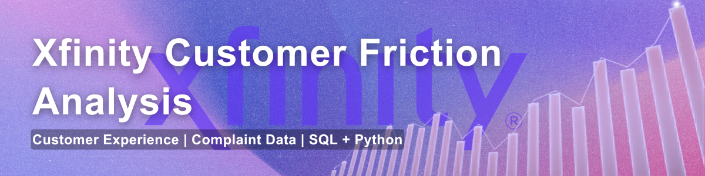
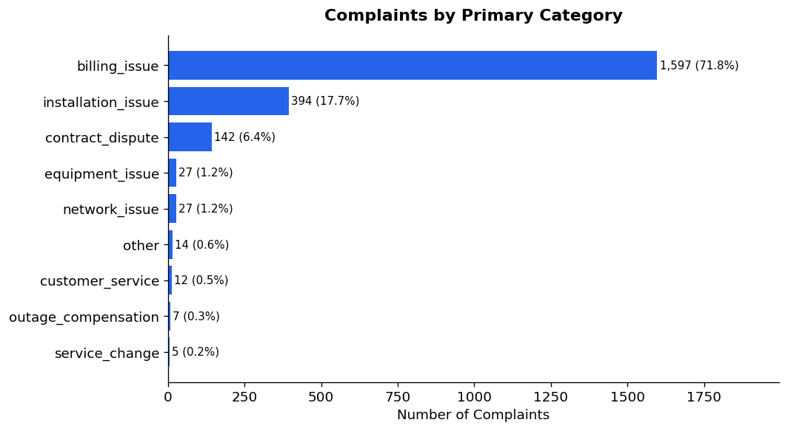
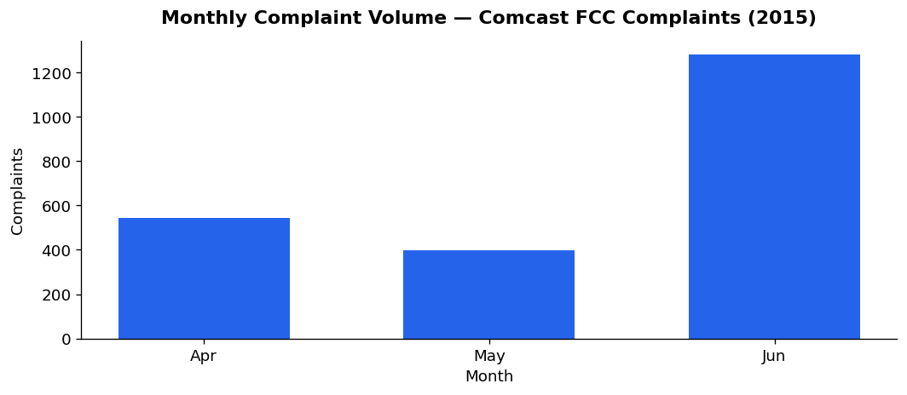
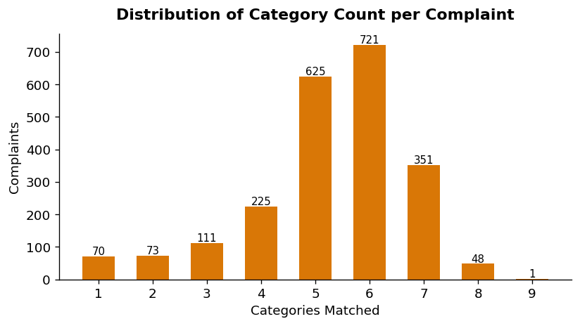

# Xfinity Customer Friction Analysis
This project analyzes customer complaint data to identify systemic friction points across service, billing, and support operations.




---

## Business Context

Customer complaints are one of the clearest signals of where a business is failing at scale.

For telecom companies like Xfinity, complaints reflect breakdowns across billing systems, network reliability, installation processes, and customer support operations. Identifying patterns within this data helps prioritize operational improvements and reduce customer churn.

This project translates raw complaint data into structured, business-aligned insights to identify the primary drivers of customer friction.

---

## Objective

Transform unstructured complaint data into a framework that answers:

- Where are customers experiencing the most friction?
- What types of issues drive the highest complaint volume?
- How complex are complaints (single vs. multi-issue)?
- How do issues vary across regions?

---

## Dataset

- Source: FCC + Consumer Affairs complaint data (via Kaggle)  
- Approx. size: ~2,200 complaints  
- Timeframe: 2015 (FCC dataset)  
- Data includes:
  - Complaint text  
  - State  
  - Status  
  - Channel  
  - Date  

Due to file size constraints, this repository includes a **sample of the processed dataset**.  
Analysis and insights are based on the full dataset.

Raw data is not included in this repository. In production environments, raw data would typically be stored in external systems (e.g., data warehouses or object storage).

Access the original dataset here:  
https://www.kaggle.com/code/anik424/eda-comcast-consumer-complaints-analysis-using-r

---

## 🧠 Methodology

### 1. Data Cleaning
- Standardized text fields  
- Extracted time-based features (month, day)  
- Normalized categorical fields (state, status)  
---
### 2. Complaint Classification

To translate unstructured complaint text into actionable insights, a **multi-label keyword classification system** was developed based on telecom customer experience (CX) functions.

Rather than forcing each complaint into a single category, this approach reflects how real-world issues occur — customers often experience multiple failures within the same interaction (e.g., billing + customer service).

Each complaint is evaluated against a structured taxonomy:

- billing_issue  
- contract_dispute  
- outage_compensation  
- installation_issue  
- equipment_issue  
- network_issue  
- service_change  
- customer_service  
- data_privacy  

#### Classification Design Principles

- **Multi-label classification** — captures overlapping issues to reflect real customer experiences  
- **Priority-based primary category** — assigns a dominant category based on business impact (financial → operational → experience)  
- **Complexity measurement (`category_count`)** — quantifies how many issues are present, identifying high-friction, multi-system failures  

This structure supports analysis at both:
- **Volume level** — what issues are most common  
- **Complexity level** — which complaints are most operationally challenging  

---

### 3. SQL Analysis Layer

Structured queries simulate a warehouse-style analytics workflow:

- Volume trends over time  
- Category distribution  
- State-level complaint patterns  
- Multi-category (high-complexity) complaints  
---
SQL is organized by analytical theme for clarity and reuse.
---
## Strategic Insights

- Customer complaints are rarely isolated — they cluster across multiple service areas
- Billing issues frequently trigger secondary support interactions, increasing friction
- High-complexity complaints indicate breakdowns across internal teams, not single failures
- Channel data suggests digital support does not fully resolve issues, leading to repeat contact

These patterns highlight the importance of treating customer experience as a connected system rather than siloed touchpoints.
---
## 📊 Visual Insights

### Complaint Distribution by Category


### Monthly Complaint Volume


### Complaint Complexity Distribution


---

> 💡 **Insight:**  
> Multi-category complaints indicate systemic failures, where issues span multiple operational layers (e.g., billing + support). These cases represent the highest-friction customer experiences.

---
## 📌 Business Implications

- Financial friction (billing) is the primary driver of escalation, indicating a need for clearer pricing, billing transparency, and dispute resolution flows  
- Overlap between customer service and other categories suggests support teams are handling downstream failures rather than resolving root causes  
- Multi-category complaints highlight systemic breakdowns across functions, requiring cross-functional CX solutions rather than isolated fixes
---

## 🎯 Key Findings

- **Billing issues dominate complaint volume**, indicating financial friction is the primary escalation driver  
- **Customer service and billing frequently overlap**, suggesting resolution failures—not just root issues—drive complaints  
- **Multi-category complaints represent high-complexity cases**, often involving both operational and support breakdowns  
- **Complaint volume varies significantly by state**, though not normalized by subscriber base  

---

## 🧱 Project Structure

```bash
xfinity-customer-friction-analysis/
├── data/
│   ├── raw/
│   └── processed/
│       └── sample_comcast_complaints.csv
├── notebooks/
│   ├── 01_data_cleaning.ipynb
│   ├── 02_classification.ipynb
│   └── 03_eda_and_insights.ipynb
├── sql/
│   ├── volume_trends.sql
│   ├── category_breakdown.sql
│   ├── state_analysis.sql
│   └── complexity_analysis.sql
├── src/
│   └── classify.py
├── visuals/
│   ├── category_distribution.png
│   ├── monthly_complaint_volume.png
│   └── complexity_distribution.png
├── README.md
├── ROADMAP.md
└── requirements.txt
```
---

## How to Run
1. Install dependencies:

```bash
pip install -r requirements.txt
```
Run notebooks in order:
- 01_data_cleaning.ipynb
- 02_classification.ipynb
- 03_eda_and_insights.ipynb
Run SQL queries in your preferred environment (SQLite, Snowflake, etc.)
## Limitations
- Keyword-based classification (no NLP or ML model)
- No negation handling (e.g., “not slow” may misclassify)
- State-level analysis not normalized by population or subscriber base
- Dataset limited to ~2,200 complaints from a specific time period
## Why This Project Matters

### This project demonstrates the ability to:

Translate unstructured text data into structured insights
Align analysis with real business functions
Combine Python and SQL in a realistic workflow
Move from raw data → classification → insight generation

It reflects how customer experience data can be operationalized to support decision-making at scale.
